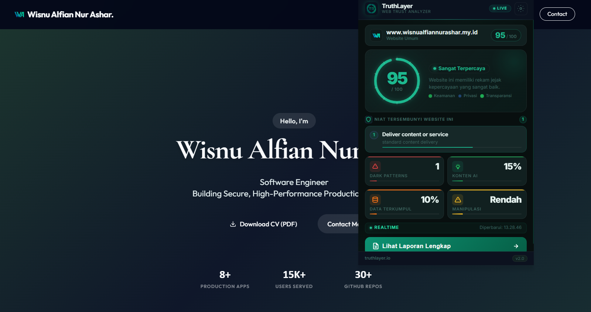
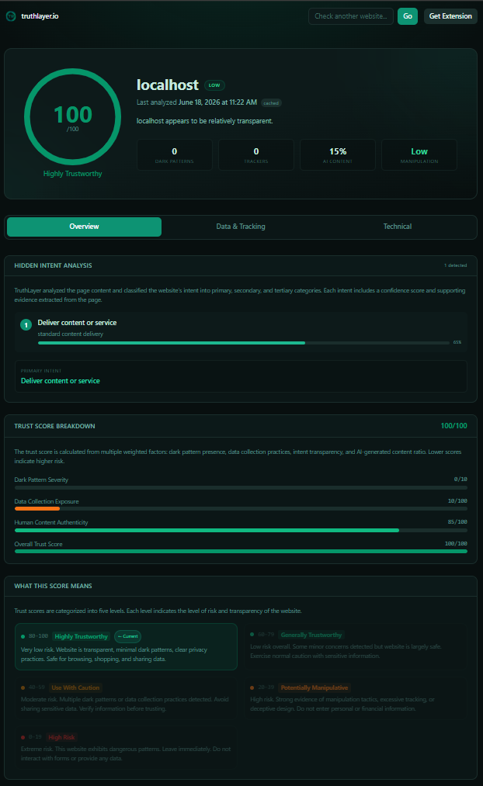
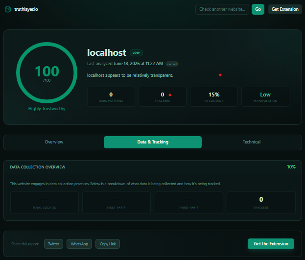
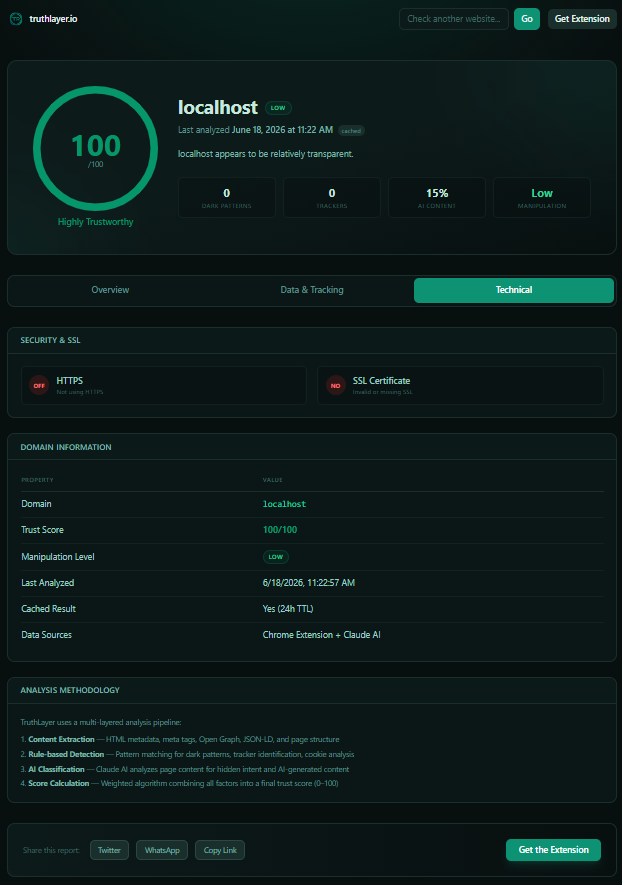

<div align="center">
  <picture>
    <source media="(prefers-color-scheme: dark)" srcset="web/public/truthlayer.png">
    
  </picture>
  <h1>TruthLayer</h1>
  <p><strong>Setiap website ingin sesuatu dari kamu. Sekarang kamu tahu apa itu.</strong></p>
  <p>
    <a href="LICENSE"></a>
    <a href="https://github.com/wi5nuu/Truthlayer/actions/workflows/ci.yml"></a>
    <a href="https://github.com/wi5nuu/Truthlayer/issues"></a>
    <a href="https://github.com/wi5nuu/Truthlayer"></a>
  </p>
  <p>
    <a href="#screenshots">Screenshots</a> •
    <a href="#features">Features</a> •
    <a href="#installation">Installation</a> •
    <a href="#architecture">Architecture</a> •
    <a href="#api-reference">API</a> •
    <a href="#testing">Testing</a> •
    <a href="#privacy">Privacy</a>
  </p>
</div>

---

## Overview

TruthLayer adalah **Chrome Extension + Backend + Web Dashboard** yang mengungkap niat tersembunyi setiap website yang Anda kunjungi. Dalam satu klik, TruthLayer memberikan:

| Metrik | Deskripsi |
|--------|-----------|
| **Trust Score (0-100)** | Skor kepercayaan website berdasarkan dark pattern, data tracking, dan transparansi konten |
| **Hidden Intent** | Niat utama, sekunder, dan tersier dari website |
| **Dark Patterns** | Deteksi 10+ taktik manipulasi: fake urgency, confirmshaming, roach motel, disguised ads, forced action |
| **Data Collection Audit** | Lacak data yang dikumpulkan website, termasuk cookie pihak ketiga dan tracker |
| **AI Content Estimate** | Estimasi persentase konten buatan AI |
| **Manipulation Level** | Tingkat manipulasi: low / medium / high / extreme |
| **Public Report** | Bagikan hasil analisis via tautan publik truthlayer.io/report/domain.com |

---

## Screenshots

<div align="center">
  <table>
    <tr>
      <td align="center"><strong>Analisis Website Publik</strong></td>
    </tr>
    <tr>
      <td></td>
    </tr>
    <tr>
      <td align="center"><strong>Laporan Lengkap - Overview Tab</strong></td>
    </tr>
    <tr>
      <td align="center"></td>
    </tr>
    <tr>
      <td align="center"><strong>Laporan Lengkap - Data & Tracking Tab</strong></td>
    </tr>
    <tr>
      <td align="center"></td>
    </tr>
    <tr>
      <td align="center"><strong>Laporan Lengkap - Technical Tab</strong></td>
    </tr>
    <tr>
      <td align="center"></td>
    </tr>
  </table>
</div>

---

## Features

<details>
<summary><strong>Trust Score Engine</strong> - Klik untuk detail</summary><br>

Trust Score dihitung dari 4 faktor utama dengan bobot berbeda:

| Faktor | Bobot | Sumber Data |
|--------|-------|-------------|
| **Dark Pattern Detection** | 35% | Content script + Backend AI |
| **Data Collection Audit** | 25% | Request blocking analysis |
| **Intent Transparency** | 20% | AI intent classification |
| **AI Content Ratio** | 20% | AI content estimation |

Skor akhir: 100 - (total penalty). Semakin rendah skor, semakin mencurigakan website tersebut.
</details>

<details>
<summary><strong>Dark Pattern Detection</strong> - 10+ pola manipulasi terdeteksi</summary><br>

| Pattern | Deskripsi |
|---------|-----------|
| **Fake Urgency** | Hitung mundur palsu, stok terbatas palsu |
| **Confirmshaming** | "No thanks, I don't want to save money" |
| **Roach Motel** | Mudah daftar, sulit hapus akun |
| **Disguised Ads** | Iklan yang menyamar sebagai konten |
| **Forced Action** | Harus melakukan X untuk mengakses Y |
| **Misdirection** | UI yang sengaja membingungkan |
| **Hidden Costs** | Biaya tersembunyi di checkout |
| **Subscription Trap** | Berlangganan otomatis tanpa konfirmasi |
| **Social Proof Fake** | Testimoni atau jumlah pengguna palsu |
| **Privacy Zuckering** | Trik untuk membuat user share lebih banyak data |

</details>

<details>
<summary><strong>AI-Powered Analysis</strong> - Claude AI di balik layar</summary><br>

TruthLayer menggunakan **Claude AI (Anthropic)** untuk:
- Mengklasifikasikan niat tersembunyi website (primary, secondary, tertiary)
- Mendeteksi dark pattern tingkat lanjut yang tidak bisa dideteksi oleh rule-based engine
- Memperkirakan persentase konten buatan AI
- Memberikan rekomendasi keamanan sesuai konteks

Setiap analisis melalui 3 tahap:
1. **Content Script Scan** - Ekstrak metadata, tracker, cookies, dark pattern client-side
2. **Backend Processing** - Kirim HTML ke backend untuk analisis mendalam
3. **AI Classification** - Claude AI mengklasifikasikan intent dan memberikan skor
</details>

<details>
<summary><strong>Public Report Sharing</strong> - Bagikan hasil analisis</summary><br>

Setiap hasil analisis otomatis menghasilkan halaman publik yang bisa dibagikan:
- Format: https://truthlayer.io/report/example.com
- Berisi: Trust score, intent breakdown, dark patterns detected, data collection audit
- Bisa diakses tanpa ekstensi
- SEO friendly untuk pencarian domain trust information
</details>

<details>
<summary><strong>Local Caching</strong> - Analisis cepat, tanpa beban server</summary><br>

- **TTL cache**: 24 jam per domain
- **Storage**: Chrome storage.local untuk extension, in-memory untuk backend
- **Benefit**: Analisis kedua untuk domain yang sama instant tanpa panggilan API
- **Kontrol**: Clear cache via halaman Options extension
</details>

<details>
<summary><strong>Keyboard Shortcuts</strong> - Akses lebih cepat</summary><br>

| Shortcut | Aksi |
|----------|------|
| Ctrl + Shift + T (Windows/Linux) / Cmd + Shift + T (Mac) | Buka popup TruthLayer |
| Ctrl + Shift + Y (Windows/Linux) / Cmd + Shift + Y (Mac) | Toggle auto-analyze |
</details>

---

## Browser & Platform Support

TruthLayer berjalan di **semua browser berbasis Chromium**.

| Browser | Status | Minimal Versi | Catatan |
|---------|--------|---------------|---------|
| **Google Chrome** | Supported | Chrome 88+ | Manifest V3 - fitur penuh |
| **Microsoft Edge** | Supported | Edge 88+ | Chromium-based - fitur penuh |
| **Brave** | Supported | Brave 1.0+ | Chromium-based - fitur penuh |
| **Opera** | Supported | Opera 74+ | Via "Load unpacked" |
| **Vivaldi** | Supported | Vivaldi 3.0+ | Chromium-based - fitur penuh |
| **Mozilla Firefox** | Coming Soon | - | MV3 migration in progress |
| **Apple Safari** | Planned | - | Safari Web Extensions on roadmap |

> Catatan: Semua browser Chromium menggunakan codebase yang sama, sehingga TruthLayer berfungsi identik di Chrome, Edge, Brave, Opera, dan Vivaldi. Tidak ada perbedaan fitur antar browser.

### Platform

| Platform | Status | Catatan |
|----------|--------|---------|
| Windows 10/11 | **Supported** | Diuji pada Chrome, Edge, Brave |
| macOS | **Supported** | Diuji pada Chrome, Edge |
| Linux (Ubuntu, Fedora, Arch) | **Supported** | Diuji pada Chrome, Brave |
| Android | **Planned** | Kiwi Browser support in development |
| iOS | **Planned** | Safari Web Extensions on roadmap |

## Installation

### Chrome & Chromium Extensions

```bash
git clone https://github.com/wi5nuu/Truthlayer.git
cd truthlayer

# Load extension di Chrome / Edge / Brave / Opera:
# 1. Buka chrome://extensions (atau edge://extensions, brave://extensions, opera://extensions)
# 2. Aktifkan "Developer mode" (pojok kanan atas)
# 3. Klik "Load unpacked"
# 4. Pilih folder extension/
```

### Quick Install (Download ZIP)

Download ZIP langsung dari GitHub:
```bash
# Download: https://github.com/wi5nuu/Truthlayer/archive/refs/heads/main.zip
# Extract ZIP ke folder lokal
# Buka chrome://extensions -> Developer mode -> Load unpacked -> pilih folder extension/
```

### Backend API

**Prerequisites:** Node.js >= 18

```bash
cd backend
cp .env.example .env
npm install
npm run dev          # Development dengan nodemon http://localhost:3001
# atau
npm start            # Production
```

**Environment Variables:**

| Variable | Default | Description |
|----------|---------|-------------|
| `PORT` | `3001` | Port server |
| `NODE_ENV` | `development` | Environment mode |
| `CORS_ORIGIN` | `http://localhost:3000` | Web dashboard origin |
| `CORS_EXTENSION_ORIGIN` | `chrome-extension://*` | Extension origin |
| `RATE_LIMIT_WINDOW_MS` | `60000` | Rate limit window (ms) |
| `RATE_LIMIT_MAX` | `100` | Max requests per window |
| `CACHE_TTL_MS` | `86400000` | Cache TTL (24 jam) |

### Web Dashboard

**Prerequisites:** Node.js >= 18

```bash
cd web
npm install
npm run dev          # Development http://localhost:3000
# atau
npm run build && npm start   # Production
```

### Docker (Production)

```bash
docker-compose up --build
# Backend: http://localhost:3001
# Web:     http://localhost:3000
```

> Catatan untuk Windows: `next build` mungkin error EISDIR di Node.js 22+. Gunakan `npm run dev` untuk development, atau Docker untuk production build.

> Catatan Backend: Extension membutuhkan backend server yang berjalan di `localhost:3001`. Backend TIDAK di-host di cloud -- setiap pengguna harus menjalankannya sendiri secara lokal.

### Deploy Web ke Netlify

```bash
# 1. Push ke GitHub
# 2. Di Netlify: New site -> Import from GitHub -> pilih repo
# 3. Set:
#    - Base directory: web/
#    - Build command: npm run build
#    - Publish directory: .next
# 4. Deploy
```

Atau gunakan `netlify.toml` yang sudah disediakan di root project.

### One-Command Setup

```bash
node scripts/setup.js
```

Script ini akan:
1. Install dependencies backend & web
2. Copy .env.example ke .env (jika belum ada)
3. Jalankan test backend
4. Konfigurasi git hooks

---

## Architecture

```
                                +------------------------------------+
                                |         Chrome Extension          |
                                |  +----------+  +----------------+ |
                                |  |  Popup   |  | Service Worker | |
                                |  |  (UI)    |  | (Background)   | |
                                |  +-----+-----+  +-------+--------+ |
                                |        |                 |        |
                                |  +-----+-----------------+-----+  |
                                |  |       Content Script        |  |
                                |  |  (Extract: metadata, etc.)  |  |
                                |  +---------------+-------------+  |
                                +------------------+----------------+
                                                    |
                                                    v
                          +------------------------------------------+
                          |        Backend API (Express.js)          |
                          |                                          |
                          |  POST /api/v1/analyze                    |
                          |  GET  /api/v1/report/:domain             |
                          |  GET  /api/v1/report/:domain/history     |
                          |                                          |
                          |  +----------+  +----------------+        |
                          |  |  Cache   |  |  AI Analyzer   |        |
                          |  | (Memory) |  |  (Claude AI)   |        |
                          |  +----------+  +-------+--------+        |
                          +-----------------------+------------------+
                                                    |
                                                    v
                                         +------------------+
                                         |   Claude AI      |
                                         |  (Anthropic)     |
                                         +------------------+

                          +------------------------------------------+
                          |       Web Dashboard (Next.js 15)         |
                          |                                          |
                          |  /              Landing page             |
                          |  /about         About page               |
                          |  /privacy       Privacy policy           |
                          |  /report/:domain Public report           |
                          |                                          |
                          |  +---------------------------------+     |
                          |  |  SSR Rewrites -> Backend        |     |
                          |  +---------------------------------+     |
                          +------------------------------------------+
```

### Data Flow

```
User opens website
      |
      v
Content Script injected --- Extract metadata, trackers, cookies
      |
      v
Popup: user clicks analyze
      |
      v
POST /api/v1/analyze --- Kirim HTML + metadata ke backend
      |
      v
Backend menerima request
      |
      +-- Check cache --- Jika ada cache (< 24 jam) -> return cached result
      |
      +-- Analisis pipeline:
          |
          +-- 1. Rule-based Dark Pattern Detection
          +-- 2. Claude AI: Intent Classification
          +-- 3. Trust Score Calculation
          +-- 4. Cache result -> return response
```

---

## Project Structure

```
truthlayer/
|
+-- extension/                    # Chrome Extension (Manifest V3)
|   +-- manifest.json             # Extension manifest
|   +-- popup/                    # Popup UI
|   +-- background/               # Service worker
|   +-- content/                  # Content script
|   +-- options/                  # Settings page
|   +-- welcome/                  # Onboarding page
|   +-- icons/                    # SVG icons
|   +-- _locales/                 # i18n translations
|
+-- backend/                      # Node.js Express API
|   +-- src/
|   |   +-- app.js                # Express app setup
|   |   +-- server.js             # Server entry point
|   |   +-- routes/               # API routes
|   |   +-- services/             # Business logic
|   |   +-- middleware/           # Express middleware
|   +-- tests/                    # Jest test suites
|   +-- .env.example
|   +-- package.json
|
+-- web/                          # Next.js 15 Dashboard
|   +-- app/                      # App router pages
|   +-- components/               # React components
|   +-- lib/                      # API client
|   +-- public/                   # Static assets
|   +-- package.json
|
+-- shared/                       # TypeScript utilities
+-- scripts/                      # Dev scripts
+-- .github/workflows/            # CI configuration
+-- docs/                         # Documentation
+-- docker-compose.yml
+-- LICENSE
+-- CHANGELOG.md
```

---

## API Reference

### Health Check

```
GET /health
```

**Response:**
```json
{
  "status": "ok",
  "timestamp": "2026-06-11T10:00:00.000Z",
  "uptime": 1234.56
}
```

### Analyze Website

```
POST /api/v1/analyze
Content-Type: application/json
Authorization: Bearer <token>
```

**Request Body:**
```json
{
  "url": "https://example.com",
  "html": "<!DOCTYPE html><html>..."
}
```

**Response:**
```json
{
  "success": true,
  "domain": "example.com",
  "trustScore": 72,
  "primaryIntent": "e-commerce",
  "intents": [],
  "darkPatterns": { "count": 0, "detected": [] },
  "dataCollection": { "percentage": 30, "trackers": [], "dataTypes": [] },
  "aiContent": { "percentage": 15, "confidence": 0.6 },
  "manipulationLevel": "medium",
  "summary": "analysis summary here"
}
```

### Get Report

```
GET /api/v1/report/:domain
```

### Report History (Paginated)

```
GET /api/v1/report/:domain/history?page=1&limit=10
```

### Export Data

```
GET /api/v1/export/:domain/json
GET /api/v1/export/:domain/csv
```

### Response Codes

| Code | Description |
|------|-------------|
| `200` | Success |
| `400` | Bad request (missing parameters, invalid URL) |
| `401` | Unauthorized (missing/invalid token) |
| `403` | Forbidden (CORS not allowed) |
| `404` | Not found |
| `429` | Rate limit exceeded |
| `500` | Internal server error |
| `504` | Analysis timeout |

---

## Testing

```bash
# Jalankan semua test backend
cd backend && npm test

# Jalankan test spesifik
npm test -- --testPathPattern=analyze
npm test -- --testPathPattern=health
npm test -- --testPathPattern=export
npm test -- --testPathPattern=trust-scorer
npm test -- --testPathPattern=integration
```

**Test Coverage:**

| Test Suite | Tests | Description |
|------------|-------|-------------|
| `health.test.js` | 1 | Health endpoint validation |
| `analyze.test.js` | 7 | Analyze endpoint & AI integration |
| `export.test.js` | 4 | Export JSON & CSV endpoints |
| `trust-scorer.test.js` | 6 | Trust score calculation |
| `integration.test.js` | 3 | Full API workflow |
| **Total** | **21** | |

### Verification Script

```bash
node scripts/verify-all.js
```

Menjalankan seluruh pipeline: lint -> test -> build untuk memastikan semua komponen berfungsi sebelum commit/push.

---

## CI/CD

GitHub Actions otomatis menjalankan pipeline berikut untuk setiap push ke `main` dan setiap pull request:

| Job | Deskripsi | Tools |
|-----|-----------|-------|
| **backend-test** | Unit & integration tests | Jest + Supertest |
| **web-lint** | Linting Next.js | ESLint + Next.js lint |
| **web-build** | Production build | Next.js build |
| **extension-build** | Validasi extension manifest | Custom check |

---

## Privacy & Security

TruthLayer dirancang dengan **privacy-first approach**:

### Data Collection

| Data | Dikumpulkan? | Untuk Apa? |
|------|-------------|------------|
| URL website | Ya | Analisis domain & niat |
| HTML konten | Ya | Deteksi dark pattern & AI analysis |
| Cookies & tracker | Ya | Data collection audit |
| Data pribadi user | Tidak | Tidak pernah dikumpulkan |
| Riwayat browsing | Tidak | Hanya halaman yang diklik |
| Keyboard/mouse | Tidak | Tidak pernah direkam |

### Keamanan

- **activeTab permission** - Extension hanya aktif saat icon diklik
- **Local cache 24 jam** - Hasil analisis disimpan lokal, bukan di server
- **No tracking** - TruthLayer tidak melacak penggunanya
- **HTTPS only** - Semua komunikasi API melalui HTTPS
- **Rate limiting** - Backend dilindungi rate limiter (100 req/min)
- **Helmet.js** - Security headers untuk backend

### Permission Extension

| Permission | Alasan |
|------------|--------|
| `activeTab` | Akses halaman saat icon diklik |
| `storage` | Cache lokal hasil analisis |
| `notifications` | Notifikasi hasil analisis |
| `host_permissions` | Inject content script |

---

## Tech Stack

### Frontend

| Teknologi | Kegunaan |
|-----------|----------|
| Chrome Extension MV3 | Browser extension Manifest V3 |
| Next.js 15 | Web dashboard & public report |
| React 18 | UI framework |
| TypeScript | Type safety |
| Tailwind CSS | Styling |

### Backend

| Teknologi | Kegunaan |
|-----------|----------|
| Node.js | Runtime |
| Express.js | Web framework |
| Jest | Testing |
| Helmet | Security headers |

### AI & Analysis

| Teknologi | Kegunaan |
|-----------|----------|
| Claude AI (Anthropic) | AI-powered intent classification |
| Dark Pattern Engine | Rule-based client-side detection |
| Trust Scorer | Multi-factor scoring algorithm |

### Infrastructure

| Teknologi | Kegunaan |
|-----------|----------|
| Docker | Containerization |
| GitHub Actions | CI/CD |
| ESLint | Code quality |
| Prettier | Code formatting |

---

## Contributing

Silakan lihat [CONTRIBUTING.md](CONTRIBUTING.md) untuk panduan lengkap.

1. Fork repository
2. Buat branch fitur: `git checkout -b feat/amazing-feature`
3. Commit: `git commit -m "feat: add amazing feature"`
4. Push: `git push origin feat/amazing-feature`
5. Buka Pull Request

### Development Guidelines

- **Backend**: Test harus lulus sebelum pull request (`cd backend && npm test`)
- **Web**: Build harus sukses (`cd web && npm run build`)
- **Formatting**: Jalankan `npx prettier --write .` sebelum commit
- **Conventional Commits**: Gunakan prefix `feat:`, `fix:`, `chore:`, `docs:`, `test:`, `ci:`

---

## Roadmap

- [ ] **User Dashboard** - Riwayat analisis personal, saved domains, alerts
- [ ] **Browser Comparison** - Bandingkan trust score antar website
- [ ] **API Token Management** - Kelola API key untuk akses programmatic
- [ ] **Real-time Monitoring** - Notifikasi push saat website mencurigakan terdeteksi
- [ ] **Dark Pattern Database** - Database kolektif dark pattern dari komunitas
- [ ] **Firefox & Edge Full Support** - Ekspansi ke browser non-Chromium
- [ ] **Mobile Companion App** - Scan link via mobile app

---

## Changelog

Lihat [CHANGELOG.md](CHANGELOG.md) untuk riwayat rilis lengkap.

---

## License

[MIT](LICENSE) (c) 2026 TruthLayer

---

<div align="center">
  <p>Dibangun untuk web yang lebih transparan</p>
  <p>
    <a href="https://github.com/wi5nuu/Truthlayer/issues/new?labels=bug">Laporkan Bug</a>
    •
    <a href="https://github.com/wi5nuu/Truthlayer/issues/new?labels=enhancement">Saran Fitur</a>
    •
    <a href="SECURITY.md">Keamanan</a>
  </p>
</div>
