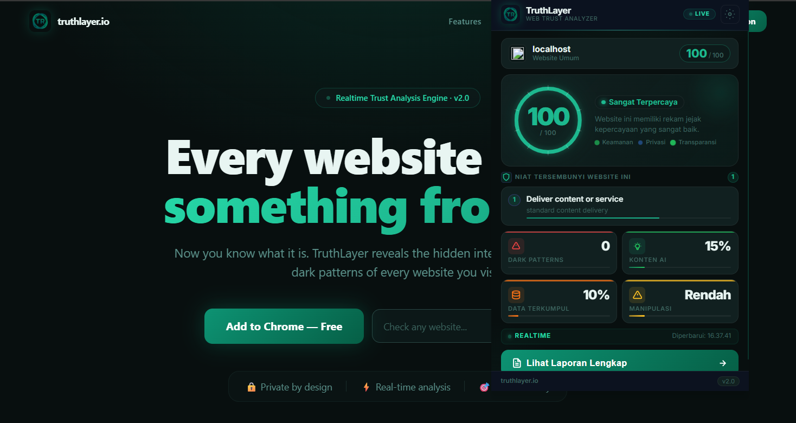
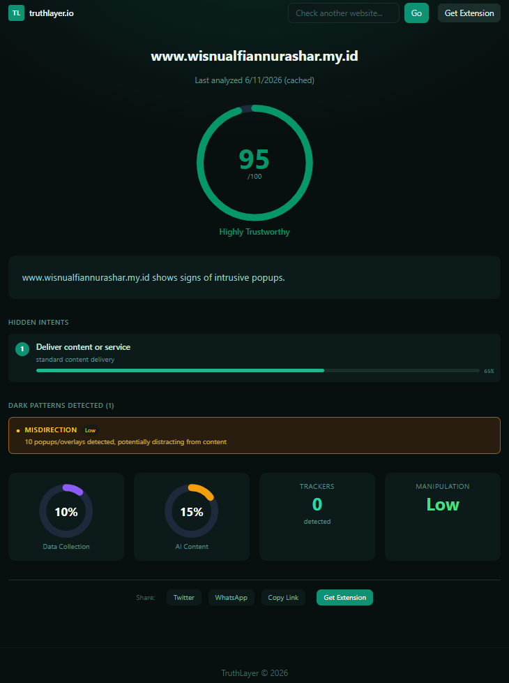

<div align="center">
  <picture>
    <source media="(prefers-color-scheme: dark)" srcset="web/public/truthlayer.png">
    
  </picture>
  <h1>TruthLayer</h1>
  <p><strong>Setiap website ingin sesuatu dari kamu. Sekarang kamu tahu apa itu.</strong></p>
  <p>
    <a href="https://github.com/wi5nuu/Truthlayer/releases"></a>
    <a href="LICENSE"></a>
    <a href="https://github.com/wi5nuu/Truthlayer/actions/workflows/ci.yml"></a>
    <a href="https://github.com/wi5nuu/Truthlayer/issues"></a>
    <a href="https://github.com/wi5nuu/Truthlayer"></a>
  </p>
  <p>
    <a href="#-screenshots">Screenshots</a> •
    <a href="#-features">Features</a> •
    <a href="#-installation">Installation</a> •
    <a href="#-architecture">Architecture</a> •
    <a href="#-api-reference">API</a> •
    <a href="#-testing">Testing</a> •
    <a href="#-privacy">Privacy</a>
  </p>
</div>

---

## Overview

TruthLayer adalah **Chrome Extension + Backend + Web Dashboard** yang mengungkap niat tersembunyi setiap website yang Anda kunjungi. Dalam satu klik, TruthLayer memberikan:

| Metrik | Deskripsi |
|--------|-----------|
| **Trust Score (0–100)** | Skor kepercayaan website berdasarkan dark pattern, data tracking, dan transparansi konten |
| **Hidden Intent** | Niat utama, sekunder, dan tersier — apa sebenarnya yang website ini inginkan? |
| **Dark Patterns** | Deteksi 10+ taktik manipulasi: fake urgency, confirmshaming, roach motel, disguised ads, forced action, dll |
| **Data Collection Audit** | Lacak semua data yang dikumpulkan oleh website, termasuk cookie pihak ketiga dan tracker |
| **AI Content Estimate** | Estimasi persentase konten yang dibuat oleh AI |
| **Manipulation Level** | Tingkat manipulasi: `low` / `medium` / `high` / `extreme` |
| **Public Report** | Bagikan hasil analisis via tautan publik `truthlayer.io/report/domain.com` |

---

## Screenshots

<div align="center">
  <table>
    <tr>
      <td align="center"><strong>🔍 Analisis Website Publik</strong></td>
      <td align="center"><strong>🧪 Pengujian Lokal</strong></td>
    </tr>
    <tr>
      <td></td>
      <td></td>
    </tr>
    <tr>
      <td colspan="2" align="center"><strong>📊 Laporan Lengkap (Public Report Page)</strong></td>
    </tr>
    <tr>
      <td colspan="2" align="center"></td>
    </tr>
  </table>
</div>

---

## Features

<details>
<summary><strong>🛡️ Trust Score Engine</strong> — Klik untuk detail</summary><br>

Trust Score dihitung dari 4 faktor utama dengan bobot berbeda:

| Faktor | Bobot | Sumber Data |
|--------|-------|-------------|
| **Dark Pattern Detection** | 35% | Content script + Backend AI |
| **Data Collection Audit** | 25% | Request blocking analysis |
| **Intent Transparency** | 20% | AI intent classification |
| **AI Content Ratio** | 20% | AI content estimation |

Skor akhir: **100 − (total penalty)**. Semakin rendah skor, semakin mencurigakan website tersebut.
</details>

<details>
<summary><strong>🎭 Dark Pattern Detection</strong> — 10+ pola manipulasi terdeteksi</summary><br>

| Pattern | Deskripsi |
|---------|-----------|
| 🔥 **Fake Urgency** | Hitung mundur palsu, stok terbatas palsu |
| 😞 **Confirmshaming** | "No thanks, I don't want to save money" |
| 🪤 **Roach Motel** | Mudah daftar, sulit hapus akun |
| 🎯 **Disguised Ads** | Iklan yang menyamar sebagai konten |
| 📋 **Forced Action** | Harus melakukan X untuk mengakses Y |
| 🔄 **Misdirection** | UI yang sengaja membingungkan |
| 🤫 **Hidden Costs** | Biaya tersembunyi di checkout |
| ♾️ **Subscription Trap** | Berlangganan otomatis tanpa konfirmasi |
| 💬 **Social Proof Fake** | Testimoni atau jumlah pengguna palsu |
| 🔗 **Privacy Zuckering** | Trik untuk membuat user share lebih banyak data |

</details>

<details>
<summary><strong>🤖 AI-Powered Analysis</strong> — Claude AI di balik layar</summary><br>

TruthLayer menggunakan **Claude AI (Anthropic)** untuk:
- Mengklasifikasikan niat tersembunyi website (primary, secondary, tertiary)
- Mendeteksi dark pattern tingkat lanjut yang tidak bisa dideteksi oleh rule-based engine
- Memperkirakan persentase konten buatan AI
- Memberikan rekomendasi keamanan yang sesuai konteks

Setiap analisis melalui **3 tahap**:
1. **Content Script Scan** — Ekstrak metadata, tracker, cookies, dark pattern client-side
2. **Backend Processing** — Kirim HTML ke backend untuk analisis mendalam
3. **AI Classification** — Claude AI mengklasifikasikan intent dan memberikan skor
</details>

<details>
<summary><strong>📊 Public Report Sharing</strong> — Bagikan hasil analisis</summary><br>

Setiap hasil analisis otomatis menghasilkan halaman publik yang bisa dibagikan:
- Format: `https://truthlayer.io/report/example.com`
- Berisi: Trust score, intent breakdown, dark patterns detected, data collection audit
- Bisa diakses tanpa ekstensi — cukup lewat browser biasa
- SEO friendly untuk pencarian domain trust information
</details>

<details>
<summary><strong>⚡ Local Caching</strong> — Analisis cepat, tanpa beban server</summary><br>

- **TTL cache**: 24 jam per domain
- **Storage**: Chrome `storage.local` untuk extension, Redis untuk backend
- **Benefit**: Analisis kedua untuk domain yang sama instant — tanpa panggilan API
- **Kontrol**: Clear cache via halaman Options extension
</details>

<details>
<summary><strong>⌨️ Keyboard Shortcuts</strong> — Akses lebih cepat</summary><br>

| Shortcut | Aksi |
|----------|------|
| `Ctrl + Shift + T` (Windows/Linux) / `Cmd + Shift + T` (Mac) | Buka popup TruthLayer |
| `Ctrl + Shift + Y` (Windows/Linux) / `Cmd + Shift + Y` (Mac) | Toggle auto-analyze |
</details>

---

## Browser & Platform Support

TruthLayer berjalan di **semua browser berbasis Chromium** — tidak terbatas pada Chrome saja.

| Browser | Status | Minimal Versi | Catatan |
|---------|--------|---------------|---------|
|  **Google Chrome** | ✅ **Supported** | Chrome 88+ | Manifest V3 — fitur penuh |
|  **Microsoft Edge** | ✅ **Supported** | Edge 88+ | Chromium-based — fitur penuh |
|  **Brave** | ✅ **Supported** | Brave 1.0+ | Chromium-based — fitur penuh |
|  **Opera** | ✅ **Supported** | Opera 74+ | Via "Load unpacked" |
|  **Vivaldi** | ✅ **Supported** | Vivaldi 3.0+ | Chromium-based — fitur penuh |
|  **Mozilla Firefox** | 🔄 **Coming Soon** | — | MV3 migration in progress |
|  **Apple Safari** | 🔄 **Planned** | — | Safari Web Extensions on roadmap |

> **Catatan:** Semua browser Chromium menggunakan codebase yang sama, sehingga TruthLayer berfungsi identik di Chrome, Edge, Brave, Opera, dan Vivaldi. Tidak ada perbedaan fitur antar browser.

### 📊 Platform

| Platform | Status | Catatan |
|----------|--------|---------|
| Windows 10/11 | ✅ **Supported** | Diuji pada Chrome, Edge, Brave |
| macOS | ✅ **Supported** | Diuji pada Chrome, Edge |
| Linux (Ubuntu, Fedora, Arch) | ✅ **Supported** | Diuji pada Chrome, Brave |
| Android | 🔄 **Planned** | Kiwi Browser support in development |
| iOS | 🔄 **Planned** | Safari Web Extensions on roadmap |

## Installation

### 📦 Chrome & Chromium Extensions

```bash
# Clone repository
git clone https://github.com/wi5nuu/Truthlayer.git
cd truthlayer

# Load extension di Chrome / Edge / Brave / Opera:
# 1. Buka chrome://extensions (atau edge://extensions, brave://extensions, opera://extensions)
# 2. Aktifkan "Developer mode" (pojok kanan atas)
# 3. Klik "Load unpacked"
# 4. Pilih folder extension/
```

### ⚡ Quick Install (Download ZIP)

Tidak punya Git? Download ZIP langsung dari GitHub:

```bash
# Download: https://github.com/wi5nuu/Truthlayer/archive/refs/heads/main.zip
# Extract ZIP ke folder lokal
# Buka chrome://extensions → Developer mode → Load unpacked → pilih folder extension/
```

### ⚙️ Backend API

**Prerequisites:** Node.js ≥ 18

```bash
cd backend
cp .env.example .env
npm install
npm run dev          # Development dengan nodemon http://localhost:3001
# atau
npm start            # Production
```

**Environment Variables:**

| Variable | Default | Description |
|----------|---------|-------------|
| `PORT` | `3001` | Port server |
| `NODE_ENV` | `development` | Environment mode |
| `CORS_ORIGIN` | `http://localhost:3000` | Web dashboard origin |
| `CORS_EXTENSION_ORIGIN` | `chrome-extension://*` | Extension origin |
| `RATE_LIMIT_WINDOW_MS` | `60000` | Rate limit window (ms) |
| `RATE_LIMIT_MAX` | `100` | Max requests per window |
| `CACHE_TTL_MS` | `86400000` | Cache TTL (24 jam) |

### 🌐 Web Dashboard

**Prerequisites:** Node.js ≥ 18

```bash
cd web
npm install
npm run dev          # Development http://localhost:3000
# atau
npm run build && npm start   # Production
```

### 🐳 Docker (Production)

```bash
# Build dan jalankan semua service
docker-compose up --build

# Backend: http://localhost:3001
# Web:     http://localhost:3000
```

> **⚠️ Catatan untuk Windows:** `next build` mungkin error EISDIR di Node.js 22+. Gunakan `npm run dev` untuk development, atau Docker untuk production build.

> **⚠️ Catatan Backend:** Extension membutuhkan backend server yang berjalan di `localhost:3001`. Backend TIDAK di-host di cloud — setiap pengguna harus menjalankannya sendiri secara lokal. Lihat petunjuk di bagian [Backend API](#-backend-api). Versi cloud akan tersedia di rilis mendatang.

### 🌐 Deploy Web ke Netlify

```bash
# 1. Push ke GitHub
# 2. Di Netlify: New site → Import from GitHub → pilih repo
# 3. Set:
#    - Base directory: web/
#    - Build command: npm run build
#    - Publish directory: .next
# 4. Deploy
```

Atau gunakan `netlify.toml` yang sudah disediakan di root project — Netlify akan membaca konfigurasi secara otomatis.

### 🔧 One-Command Setup

```bash
node scripts/setup.js
```

Script ini akan:
1. Install dependencies backend & web
2. Copy `.env.example` ke `.env` (jika belum ada)
3. Jalankan test backend
4. Konfigurasi git hooks

---

## Architecture

```
                                ┌──────────────────────────────────────────┐
                                │           Chrome Extension              │
                                │  ┌──────────┐  ┌──────────────────┐    │
                                │  │  Popup   │  │  Service Worker  │    │
                                │  │  (UI)    │  │  (Background)   │    │
                                │  └────┬─────┘  └────────┬─────────┘    │
                                │       │                   │            │
                                │  ┌────▼───────────────────▼─────────┐  │
                                │  │       Content Script            │  │
                                │  │  (Extract: metadata, trackers,  │  │
                                │  │   cookies, dark patterns, SEO)  │  │
                                │  └────────────────┬───────────────┘  │
                                └───────────────────┼───────────────────┘
                                                    │
                                                    ▼
                          ┌───────────────────────────────────────┐
                          │          Backend API (Express.js)     │
                          │                                       │
                          │  POST /api/v1/analyze ───┐            │
                          │  GET  /api/v1/report/:domain         │
                          │  GET  /api/v1/report/:domain/history  │
                          │  GET  /api/v1/export/:domain/json     │
                          │  GET  /api/v1/export/:domain/csv      │
                          │                                       │
                          │  ┌──────────┐  ┌────────────────┐    │
                          │  │  Cache   │  │  AI Analyzer   │    │
                          │  │ (Memory) │  │  (Claude AI)   │    │
                          │  └──────────┘  └───────┬────────┘    │
                          └───────────────────────┼───────────────┘
                                                   │
                                                   ▼
                                        ┌──────────────────┐
                                        │   Claude AI      │
                                        │  (Anthropic)     │
                                        └──────────────────┘

                          ┌───────────────────────────────────────┐
                          │         Web Dashboard (Next.js 15)   │
                          │                                       │
                          │  /               Landing page        │
                          │  /about          About page          │
                          │  /privacy        Privacy policy      │
                          │  /report/:domain Public report       │
                          │  /not-found      404 page            │
                          │                                       │
                          │  ┌────────────────────────────┐       │
                          │  │  SSR Rewrites → Backend   │       │
                          │  └────────────────────────────┘       │
                          └───────────────────────────────────────┘
```

### Data Flow

```
User opens website
      │
      ▼
Content Script injected ─── Extract metadata, trackers, cookies
      │
      ▼
Popup: user clicks analyze
      │
      ▼
POST /api/v1/analyze ─── Kirim HTML + metadata ke backend
      │
      ▼
Backend menerima request
      │
      ├── Check cache ─── Jika ada cache (< 24 jam) → return cached result
      │
      └── Analisis pipeline:
          │
          ├── 1. Rule-based Dark Pattern Detection
          ├── 2. Claude AI: Intent Classification
          ├── 3. Trust Score Calculation
          └── 4. Cache result → return response
```

---

## Project Structure

```
truthlayer/
│
├── extension/                    # Chrome Extension (Manifest V3)
│   ├── manifest.json             # Extension manifest
│   ├── popup/
│   │   ├── popup.html            # UI popup
│   │   ├── popup.css             # Styling
│   │   └── popup.js              # Popup logic
│   ├── background/
│   │   └── service-worker.js     # Background service worker
│   ├── content/
│   │   └── content-script.js     # Content script injector
│   ├── options/
│   │   ├── options.html          # Settings page
│   │   ├── options.css
│   │   └── options.js
│   ├── welcome/
│   │   └── welcome.html          # Onboarding page
│   ├── icons/                    # SVG icons
│   └── _locales/                 # i18n translations
│
├── backend/                      # Node.js Express API
│   ├── src/
│   │   ├── app.js                # Express app setup
│   │   ├── server.js             # Server entry point
│   │   ├── routes/
│   │   │   ├── analyze.js        # POST /api/v1/analyze
│   │   │   ├── auth.js           # Auth routes
│   │   │   ├── report.js         # Report & history
│   │   │   └── export.js         # Export JSON/CSV
│   │   ├── services/
│   │   │   ├── ai-analyzer.js    # Claude AI integration
│   │   │   ├── cache-service.js  # In-memory cache
│   │   │   ├── dark-pattern-detector.js
│   │   │   └── trust-scorer.js   # Scoring engine
│   │   └── middleware/
│   │       ├── error-handler.js  # Global error handler
│   │       └── rate-limiter.js   # Rate limiting
│   ├── tests/
│   │   ├── analyze.test.js       # Analyze endpoint tests
│   │   ├── export.test.js        # Export endpoint tests
│   │   ├── health.test.js        # Health check tests
│   │   ├── integration.test.js   # Integration tests
│   │   └── trust-scorer.test.js  # Scoring unit tests
│   ├── .env.example              # Environment template
│   └── package.json
│
├── web/                          # Next.js 15 Dashboard
│   ├── app/
│   │   ├── page.tsx              # Landing page
│   │   ├── about/page.tsx        # About page
│   │   ├── privacy/page.tsx      # Privacy page
│   │   ├── not-found.tsx         # 404 page
│   │   └── layout.tsx            # Root layout
│   ├── components/
│   │   ├── trust-score.tsx
│   │   ├── intent-list.tsx
│   │   └── dark-pattern-badge.tsx
│   ├── lib/
│   │   └── api-client.ts         # API client
│   ├── public/                   # Static assets
│   └── package.json
│
├── shared/                       # Shared TypeScript utilities
│   └── utils.ts                  # Validation, formatting, colors
│
├── scripts/
│   ├── setup.js                  # Dev environment setup
│   ├── verify-all.js             # Full verification script
│   └── e2e-test.js               # E2E API test
│
├── .github/
│   ├── workflows/ci.yml          # GitHub Actions CI
│   ├── ISSUE_TEMPLATE/           # Issue templates
│   └── CODEOWNERS                # Code ownership
│
├── docs/
│   └── screenshots/              # Screenshots
│
├── .eslintrc.cjs                 # ESLint config
├── .prettierrc                   # Prettier config
├── .prettierignore               # Prettier ignore
├── .gitattributes                # Git attributes
├── .gitignore
├── .nvmrc                        # Node version
├── docker-compose.yml            # Docker Compose
├── LICENSE                       # MIT License
├── SECURITY.md                   # Security policy
├── CONTRIBUTING.md               # Contributing guide
└── CHANGELOG.md                  # Release notes
```

---

## API Reference

### Health Check

```
GET /health
```

**Response:**
```json
{
  "status": "ok",
  "timestamp": "2026-06-11T10:00:00.000Z",
  "uptime": 1234.56,
  "version": "1.0.0"
}
```

### Analyze Website

```
POST /api/v1/analyze
Content-Type: application/json
Authorization: Bearer <token>
```

**Request Body:**
```json
{
  "url": "https://example.com",
  "html": "<!DOCTYPE html><html>..."
}
```

**Response:**
```json
{
  "success": true,
  "data": {
    "domain": "example.com",
    "trustScore": 72,
    "intent": {
      "primary": "e-commerce",
      "secondary": "newsletter-signup",
      "tertiary": "data-collection"
    },
    "darkPatterns": [
      {
        "type": "fake-urgency",
        "severity": "high",
        "description": "Fake countdown timer detected"
      }
    ],
    "dataCollection": {
      "cookies": 12,
      "thirdPartyRequests": 8,
      "trackers": ["google-analytics", "facebook-pixel"]
    },
    "aiContentEstimate": 15,
    "manipulationLevel": "medium",
    "cachedAt": "2026-06-11T10:00:00.000Z"
  }
}
```

### Get Report

```
GET /api/v1/report/:domain
```

### Report History (Paginated)

```
GET /api/v1/report/:domain/history?page=1&limit=10
```

### Export Data

```
GET /api/v1/export/:domain/json
GET /api/v1/export/:domain/csv
```

### Response Codes

| Code | Description |
|------|-------------|
| `200` | Success |
| `400` | Bad request (missing parameters, invalid URL) |
| `401` | Unauthorized (missing/invalid token) |
| `403` | Forbidden (CORS not allowed) |
| `404` | Not found |
| `429` | Rate limit exceeded |
| `500` | Internal server error |
| `504` | Analysis timeout |

---

## Testing

```bash
# Jalankan semua test backend
cd backend && npm test

# Jalankan test spesifik
npm test -- --testPathPattern=analyze
npm test -- --testPathPattern=health
npm test -- --testPathPattern=export
npm test -- --testPathPattern=trust-scorer
npm test -- --testPathPattern=integration

# Coverage report otomatis dihasilkan setiap kali test dijalankan
```

**Test Coverage:**

| Test Suite | Tests | Description |
|------------|-------|-------------|
| `health.test.js` | 1 | Health endpoint validation |
| `analyze.test.js` | 7 | Analyze endpoint & AI integration |
| `export.test.js` | 4 | Export JSON & CSV endpoints |
| `trust-scorer.test.js` | 6 | Trust score calculation |
| `integration.test.js` | 3 | Full API workflow |
| **Total** | **21** | |

### Verification Script

```bash
node scripts/verify-all.js
```

Script ini menjalankan seluruh pipeline: lint → test → build untuk memastikan semua komponen berfungsi sebelum commit/push.

---

## CI/CD

GitHub Actions otomatis menjalankan pipeline berikut untuk setiap push ke `main` dan setiap pull request:

| Job | Deskripsi | Tools |
|-----|-----------|-------|
| **backend-test** | Unit & integration tests | Jest + Supertest |
| **web-lint** | Linting Next.js | ESLint + Next.js lint |
| **web-build** | Production build | Next.js build |
| **extension-build** | Validasi extension manifest | Custom check |

```yaml
# .github/workflows/ci.yml
on: [push, pull_request]
jobs:
  backend-test:
    runs-on: ubuntu-latest
    steps:
      - uses: actions/checkout@v4
      - uses: actions/setup-node@v4
      - run: npm ci
      - run: npm test
```

---

## Privacy & Security

TruthLayer dirancang dengan **privacy-first approach**:

### Data Collection

| Data | Dikumpulkan? | Untuk Apa? |
|------|-------------|------------|
| URL website | ✅ | Analisis domain & niat |
| HTML konten | ✅ | Deteksi dark pattern & AI analysis |
| Cookies & tracker | ✅ | Data collection audit |
| Data pribadi user | ❌ | Tidak pernah dikumpulkan |
| Riwayat browsing | ❌ | Hanya halaman yang diklik |
| Keyboard/mouse | ❌ | Tidak pernah direkam |

### Keamanan

- **`activeTab` permission** — Extension hanya aktif saat icon diklik
- **Local cache 24 jam** — Hasil analisis disimpan lokal, bukan di server
- **No tracking** — TruthLayer tidak melacak penggunanya
- **HTTPS only** — Semua komunikasi API melalui HTTPS
- **Rate limiting** — Backend dilindungi rate limiter (100 req/min)
- **Helmet.js** — Security headers untuk backend

### Permission Extension

| Permission | Alasan |
|------------|--------|
| `activeTab` | Akses halaman saat icon diklik |
| `storage` | Cache lokal hasil analisis |
| `notifications` | Notifikasi hasil analisis |
| `host_permissions` | Inject content script |

---

## Tech Stack

### Frontend

| Teknologi | Kegunaan |
|-----------|----------|
|  | Browser extension Manifest V3 |
|  | Web dashboard & public report |
|  | UI framework |
|  | Type safety |
|  | Styling |
|  | Animations |

### Backend

| Teknologi | Kegunaan |
|-----------|----------|
|  | Runtime |
|  | Web framework |
|  | Testing |
|  | Security headers |

### AI & Analysis

| Teknologi | Kegunaan |
|-----------|----------|
|  | AI-powered intent classification |
| **Dark Pattern Engine** | Rule-based client-side detection |
| **Trust Scorer** | Multi-factor scoring algorithm |

### Infrastructure

| Teknologi | Kegunaan |
|-----------|----------|
|  | Containerization |
|  | CI/CD |
|  | Code quality |
|  | Code formatting |

---

## Contributing

Kami sangat menghargai kontribusi dari komunitas! Silakan lihat [CONTRIBUTING.md](CONTRIBUTING.md) untuk panduan lengkap.

1. Fork repository
2. Buat branch fitur: `git checkout -b feat/amazing-feature`
3. Commit: `git commit -m "feat: add amazing feature"`
4. Push: `git push origin feat/amazing-feature`
5. Buka Pull Request

### Development Guidelines

- **Backend**: Test harus lulus sebelum pull request (`cd backend && npm test`)
- **Web**: Build harus sukses (`cd web && npm run build`)
- **Formatting**: Jalankan `npx prettier --write .` sebelum commit
- **Conventional Commits**: Gunakan prefix `feat:`, `fix:`, `chore:`, `docs:`, `test:`, `ci:`

---

## Roadmap

- [ ] **User Dashboard** — Riwayat analisis personal, saved domains, alerts
- [ ] **Browser Comparison** — Bandingkan trust score antar website
- [ ] **API Token Management** — Kelola API key untuk akses programmatic
- [ ] **Real-time Monitoring** — Notifikasi push saat website mencurigakan terdeteksi
- [ ] **Dark Pattern Database** — Database kolektif dark pattern dari komunitas
- [ ] **Firefox & Edge Support** — Ekspansi ke browser lain
- [ ] **Mobile Companion App** — Scan link via mobile app

---

## Changelog

Lihat [CHANGELOG.md](CHANGELOG.md) untuk riwayat rilis lengkap.

---

## License

[MIT](LICENSE) © 2026 TruthLayer

---

<div align="center">
  <p>Dibangun dengan ❤️ untuk web yang lebih transparan</p>
  <p>
    <a href="https://github.com/wi5nuu/Truthlayer/issues/new?labels=bug">🐛 Laporkan Bug</a>
    •
    <a href="https://github.com/wi5nuu/Truthlayer/issues/new?labels=enhancement">💡 Saran Fitur</a>
    •
    <a href="SECURITY.md">🔒 Keamanan</a>
  </p>
</div>
